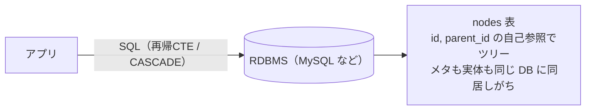

ツリー構造（自己参照テーブル）を「親を消したら子孫も全部消える」ようにしたくて `ON DELETE CASCADE` を張ろうとしたら、想像以上に引っかかる点が多かったのでまとめました。

## 結論（TL;DR）

:::message
1. **STORED な生成カラムがあると、そもそも CASCADE を張れない**（`ERROR 1215`）。VIRTUAL なら張れる。
2. **張れても CASCADE は 15 段までしか辿れない**（16 段で `ERROR 3008`）。`my.cnf` では変えられない（公式仕様）。
3. ついでに **`DELETE FROM table`（全消し）すら 3008 で失敗する**。
4. **CASCADE は子テーブルのトリガを発火しない** → 監査ログ等が静かに漏れる（公式仕様）。
5. 性能差は小さく環境依存（手元では分割 DELETE がやや速い程度）。**判断の主因はむしろ ①〜④ の機能的な制約**。
:::

## 題材：自己参照ツリーテーブル

`parent_id` で親を指すだけのシンプルな自己参照テーブルです。ここでは「root かどうか」をインデックス用のフラグとして、`parent_id` から**生成カラム**で持たせています。

```sql
CREATE TABLE nodes (
  id        INT AUTO_INCREMENT PRIMARY KEY,
  parent_id INT NULL,                              -- root は NULL
  is_root   TINYINT AS (parent_id IS NULL) STORED, -- parent_id 由来の生成カラム
  INDEX (parent_id),
  FOREIGN KEY (parent_id) REFERENCES nodes(id)     -- まだ ON DELETE は付けていない
) ENGINE=InnoDB;
```

### 補足: 自己参照ツリーの使い所

`parent_id` の自己参照（隣接リスト）は、小〜中規模アプリで採用されることが多いです。

- WordPress の `wp_posts.post_parent`（ページ階層・添付ファイルの親）
- コメントのネスト返信（`parent_comment_id`）
- EC のカテゴリ階層 / 組織図 / 多階層メニュー
- フレームワークのツリー用ライブラリ（Rails の ancestry、Django の MPTT / treebeard など）

構成はシンプルで、**1 つの RDBMS の中**にツリー（と多くの場合は実体）を同居させ、`parent_id` を辿って操作します。



## 自己参照ツリーの課題

ここからが本題です。先ほどの `nodes` に `ON DELETE CASCADE` を入れようとすると、4 つの課題に順にぶつかります（いずれも **MySQL 8.4.8** で確認）。

### ① STORED 生成カラムがあると CASCADE を張れない（ERROR 1215）

**現象**: `parent_id` への `ON DELETE CASCADE` を張ろうとすると失敗します。

```sql
ALTER TABLE nodes
  ADD FOREIGN KEY (parent_id) REFERENCES nodes(id) ON DELETE CASCADE;
-- ERROR 1215 (HY000): Cannot add foreign key constraint
```

**理由**: MySQL は「**STORED 生成カラムの計算元（base 列）**には、CASCADE / SET NULL などの参照アクション付き FK を張れない」という制約を持っています。`parent_id` が `is_root`（STORED）の base なので弾かれます。

:::message
**生成カラムの STORED と VIRTUAL の違い**
- **STORED**: 計算結果を**ディスクに保存**する（行に実体を持つ）。
- **VIRTUAL**: 保存せず**参照時に計算**する（行に実体なし。インデックスに含めた場合だけ索引内に値が作られる）。

この制約が出るのは **STORED のときだけ**です。
:::

**対策**: `is_root` を **VIRTUAL** にすれば、同じ式のまま張れます。

| 生成カラム | `parent_id` への自己参照 CASCADE |
|---|---|
| **STORED** | ❌ `ERROR 1215` |
| 生成カラム無し | ✅ 張れる |
| **VIRTUAL** | ✅ 張れる |

（張れるのは生成カラムの **base 列**（`parent_id`）への FK です。生成カラム **自身** を FK の参照先にはできない点に注意。）

以降は `is_root` を VIRTUAL にして CASCADE を張った `nodes` で進めます。

### ② CASCADE は 15 段までしか辿れない（ERROR 3008）

**現象**: `nodes` に `root → 子 → 孫 → …` と深い鎖を入れて root を消すと、**鎖が 16 段になった時点で失敗**します（「root を含む段数が 16 = CASCADE が 15 回連鎖」でエラー）。

```sql
DELETE FROM nodes WHERE id = :root_id;
-- 16 段以上だと:
-- ERROR 3008 (HY000): Foreign key CASCADE delete/update exceeds max depth of 15.
```

失敗するとその SQL は丸ごとロールバックされます。実測した境界はこうです。

| 鎖の段数（root 含む） | CASCADE の連鎖回数 | root 削除 |
|---:|---:|---|
| **15 段** | 14 回 | ✅ 成功 |
| **16 段** | 15 回（上限） | ✅ 成功 |
| **17 段** | 16 回（上限超え） | ❌ `ERROR 3008` |

:::message
**「15段の壁」とは**: エラーメッセージに `max depth of 15` とありますが、これは「CASCADE の**連鎖回数**が 15 回まで」という意味です。root を含む**段数**に換算すると **16 段が上限、17 段目で失敗**します。タイトルの"15階層の壁"はこのエラーメッセージの数値に由来します。
:::

これは「**InnoDB の CASCADE 処理のネスト深さが 15 回で頭打ち**」という性質によるものです（深い再帰でのスタック枯渇を防ぐ上限と考えられます）。自己参照ツリーは1テーブルで簡単に深くなるぶん、当たりやすいだけです。

:::message
**補足**: これは自己参照だけの話ではありません。別テーブルを `A → B → C → …` と `ON DELETE CASCADE` で連結しても同じで、**CASCADE の連鎖が 16 回（テーブルが 17 個）になると `ERROR 3008`**（15 回・16 個までは成功）になります。テーブルをまたいでも CASCADE のネスト深さ 15 回の上限は変わりません。
:::

ちなみにこの設定は `my.cnf` で変えられません。設定値ではなく**仕様として 15 で固定**です。

> Cascading operations may not be nested more than 15 levels deep.
> — [MySQL 8.4 Reference Manual 1.7.2.3 FOREIGN KEY Constraint Differences](https://dev.mysql.com/doc/refman/8.4/en/ansi-diff-foreign-keys.html)

深度を制御するシステム変数は存在しません。

```sql
SHOW VARIABLES LIKE '%CASCADE%';   -- 該当なし
SHOW VARIABLES LIKE '%recursion%'; -- cte_max_recursion_depth / max_sp_recursion_depth（どちらも無関係）
```

`foreign_key_checks` は ON/OFF だけ（OFF にすると CASCADE が起きなくなるだけ）、`cte_max_recursion_depth` などは名前が似ているだけで FK CASCADE とは無関係です。変えるにはソースから再ビルドするしかなく、マネージドな MySQL では実質不可能です。

### ③ `DELETE FROM table`（全消し）すら 3008 で失敗する

**現象**: ②の 15 段上限は「全消し」でも顔を出します。深い鎖があると、全行削除 `DELETE FROM nodes;` すら落ちます（root 行の削除が深く CASCADE するため）。

```sql
DELETE FROM nodes;                  -- ❌ ERROR 3008

-- クリアするには FK チェックを切る（or 葉から消す）
SET FOREIGN_KEY_CHECKS = 0;
DELETE FROM nodes;
SET FOREIGN_KEY_CHECKS = 1;
```

なお `TRUNCATE TABLE nodes` は CASCADE を辿らず一括で空にできます。`TRUNCATE` が弾かれるのは「**他テーブルから** FK 参照されている」場合（`ERROR 1701`）です。自己参照 FK の場合は参照元と参照先が同一テーブルになるため、MySQL 8.0 以降では `TRUNCATE` が通ります（少なくとも 8.4.8 で確認）。ただし TRUNCATE は条件指定できない全行消去であり、特定サブツリーの削除には使えません。

### ④ CASCADE はトリガを発火しない（監査ログが漏れる）

**現象**: CASCADE で消えた行には、トリガが**発火しません**（直接 DELETE した行だけ発火する）。

```sql
-- nodes に BEFORE DELETE トリガ（監査ログ書き込み）を付ける
CREATE TRIGGER trg BEFORE DELETE ON nodes
  FOR EACH ROW INSERT INTO audit_log VALUES (OLD.id);

-- root(1) → 2 → 3 がある状態で root を消す
DELETE FROM nodes WHERE id = 1;   -- 1,2,3 すべて消えるが、audit_log に残るのは「1」だけ
```

| 削除のしかた | トリガ発火？ |
|---|---|
| 直接 DELETE した行 | ✅ する |
| CASCADE で消えた子孫 | ❌ しない |

公式ドキュメントにも明記されています。

> Cascaded foreign key actions do not activate triggers.
> — [MySQL 8.4 Reference Manual 15.1.20.5 FOREIGN KEY Constraints](https://dev.mysql.com/doc/refman/8.4/en/create-table-foreign-keys.html)

監査ログ・論理削除フラグの整合・外部リソースの後始末をトリガに頼っていると、**CASCADE 削除のときだけ子孫ぶんが静かに抜け落ちます**。

## レコード削除方法と性能評価

課題を踏まえると、ツリーの一括削除には2つの方法があります。どちらが速いかを実測しました。

### 試験方法

計測環境は **MySQL 8.4.8（InnoDB）**。2つの削除方法を比較します。

- **方式A（CASCADE）**: アプリは `DELETE WHERE id = :root` を1回。配下は DB 任せ。
- **方式B（アプリ側で消す）**: スキーマ変更なし。アプリが ① 子孫 id を集めて ② `DELETE WHERE id IN (...)` を分割実行（FK のため葉→親→root の順）。

方式 B を SQL で書くとこうです。

```sql
-- ① 子孫 id を再帰的に収集
WITH RECURSIVE sub AS (
  SELECT id FROM nodes WHERE id = :root_id
  UNION ALL
  SELECT n.id FROM nodes n JOIN sub ON n.parent_id = sub.id
)
SELECT id FROM sub;   -- アプリ側で葉→親→root に並べ替え
                      -- （FK制約があるため、親を先に消すと子の参照先がなくなりエラーになる）

-- ② 葉→親→root の順に、id をまとめて分割 DELETE（例: 5,000 件ずつ）
DELETE FROM nodes WHERE id IN (/* 葉の id … */);
-- … 残りのバッチ …
DELETE FROM nodes WHERE id IN (/* 中間〜root */);
```

計測は `SET @t1 := NOW(6); <対象SQL>; SET @t2 := NOW(6);` の差分を `NOW(6)` のマイクロ秒精度で取得し、表では ms に丸めています（サーバ側計測・各削除後に残行数 0 を確認）。テストデータは「root + 中間ノード 100 + 葉 N」（総行数 = N + 101）のツリーです。なお方式 B には**子孫 id を収集する往復**のコストも乗ります。以下の数値は手元の**単発計測の一例**であり、実装・キャッシュ状態・環境で大きくブレます。**優劣より桁感**を参考にしてください。

### 試験結果

| 葉ノード数 | 総行数 | 方式A: CASCADE (ms) | 方式B: アプリ側 (ms) |
|---:|---:|---:|---:|
| 1,000 | 1,101 | 21 | 20 |
| 3,000 | 3,101 | 56 | 48 |
| 10,000 | 10,101 | 182 | 132 |
| 50,000 | 50,101 | 986 | 751 |
| 100,000 | 100,101 | 1,943 | 1,505 |

手元では分割 DELETE がやや速い回が多かったものの、**差は小さく計測はブレます**（実装・キャッシュ状態しだいで CASCADE が速い回もありました）。数千行なら両者とも数十 ms で体感差はありません。**性能はほぼ決め手になりません**。判断は①〜④の**機能的な制約**で行うのが妥当です。

### どちらを選ぶか

| 観点 | 方式A: CASCADE | 方式B: アプリ側で消す |
|---|---|---|
| 性能（全削除） | やや遅い | 速い |
| スキーマ変更 | 要（VIRTUAL 化等） | 不要 |
| 深さの上限 | **15 段**（変更不可） | 無し |
| 誤 DELETE 耐性 | 非葉を誤って消すとサブツリー消失 | 指定 id 配下のみ |
| トリガ/監査の副作用 | 発火しない（漏れる） | DELETE するので発火する |
| アプリ実装 | id を1個渡すだけ | 子孫 id を収集＋分割 DELETE |

- **深さを浅く保てる保証が無いなら CASCADE は避ける**のが無難。15 段は設定で広げられず、深いツリーが来た瞬間に削除が詰まります。
- CASCADE を採るなら、生成カラムを VIRTUAL にしたうえで、**投入時に階層を浅く制限するアプリ側ガード**もセットで必要です。
- 性能・堅牢性・副作用の確実さを重視するなら、上限のない方式B が結局は安定です。

### 補足：深い階層・頻繁な操作に備えるなら（ツリーの持ち方3方式）

`parent_id` の隣接リストは手軽ですが、「子孫の取得・一括削除」が苦手（再帰CTE / CASCADE 頼み）でした。深い階層や subtree 操作が多いなら、ツリーの持ち方自体を変える手があります。

| | 隣接リスト（`parent_id`） | materialized path（ID 並び） | closure table |
|---|---|---|---|
| 子孫取得 | 再帰CTE / CASCADE | `path LIKE '/a/b/%'`（範囲スキャン） | `WHERE ancestor = x` |
| 祖先取得 | 再帰CTE | path を分解 | `WHERE descendant = x` |
| 挿入 | 簡単 | 簡単（親 path ＋ 自分の id） | 親の祖先ぶんを複製 |
| 移動 | 簡単（parent 変更） | 部分木の path を書き換え | ペアを張り替え |
| 深さ耐性 | CASCADE は 15 段 | 実質無制限 | 無制限 |
| 追加コスト | なし | `path` 列 | 別テーブル（行が増える） |

- **materialized path**: 各行に祖先 ID を並べた文字列（例 `/1/4/9/`）を持つ。`LIKE 'prefix%'` の範囲スキャンで子孫を一発取得。**名前ではなく「ID 並び＋バイナリ照合」**にするのがコツ（日本語名だと索引キー長・照合コスト・改名時の一括書き換えで不利になる）。
- **closure table**: 別表に「すべての (祖先, 子孫, 距離) ペア」を持つ。子孫も祖先も等価検索で速く、**深さ無制限・LIKE 不要・CASCADE 不要**。代わりにペア行が増える。

いずれも **CASCADE に依存せず**に子孫の取得・削除を制御できるので、本記事の 15 段制限やトリガ漏れを避けられます。取得が中心なら materialized path、移動が多い／深さを完全に気にしたくないなら closure table が目安です。

## まとめ

- 自己参照テーブルに `ON DELETE CASCADE` を入れるときは、**STORED 生成カラム（1215）** と **CASCADE 15 段の上限（3008・多テーブル連鎖でも同じ・`my.cnf` 変更不可）** の壁に注意。
- さらに **CASCADE はトリガを発火しない**ので、監査ログや後始末をトリガに頼っていると静かに漏れる。
- 多くのケースでは、**アプリ側で id を集めて葉から分割 DELETE する方が、深さ無制限で副作用も確実に走り堅牢**（性能差は小さく環境依存）。

### 参考（MySQL 8.4 公式）

- [15.1.20.5 FOREIGN KEY Constraints](https://dev.mysql.com/doc/refman/8.4/en/create-table-foreign-keys.html)（CASCADE とトリガ非発火、参照アクション）
- [1.7.2.3 FOREIGN KEY Constraint Differences](https://dev.mysql.com/doc/refman/8.4/en/ansi-diff-foreign-keys.html)（CASCADE は 15 段まで）
